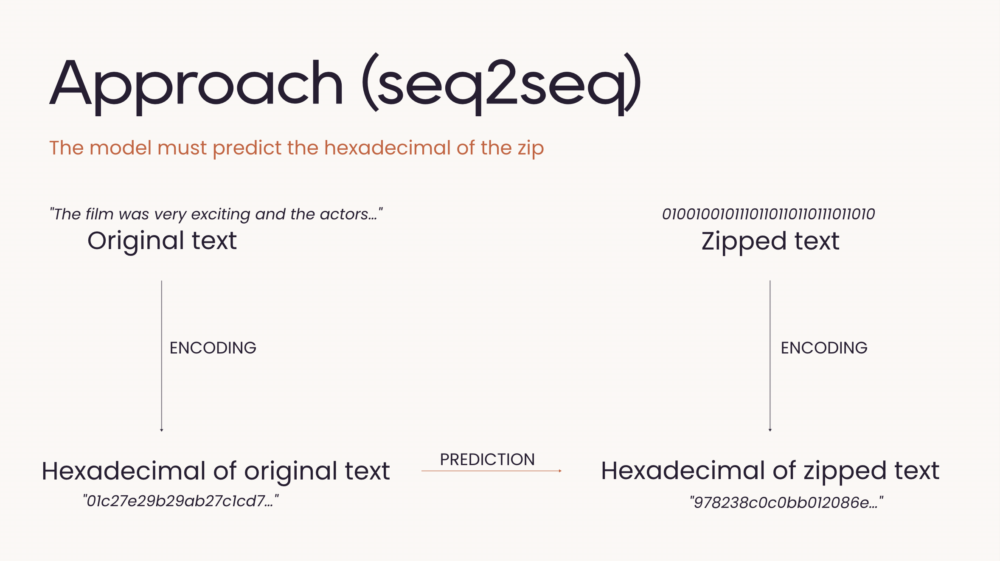

# sequence_translation_for_text_compression

This project explores the possibility of the application of neural network models to a sequence to sequence translation task with the aim of text compression. We investigate the feasibility of using deep learning techniques to emulate traditional zipping software, focusing on the Deflate algorithm for its balance between simplicity and efficiency. Our approach involves converting text and zipped files into hexadecimal format to facilitate model training and prediction. 

## Performances with bart-large

| Model      | Short Sentences | Randomized Short Sentences | Medium Sentences |
| ---------- | --------------- | -------------------------- | ---------------- |
| bart-large | 87.45%          | 85.81%                     | 69.28%           |
